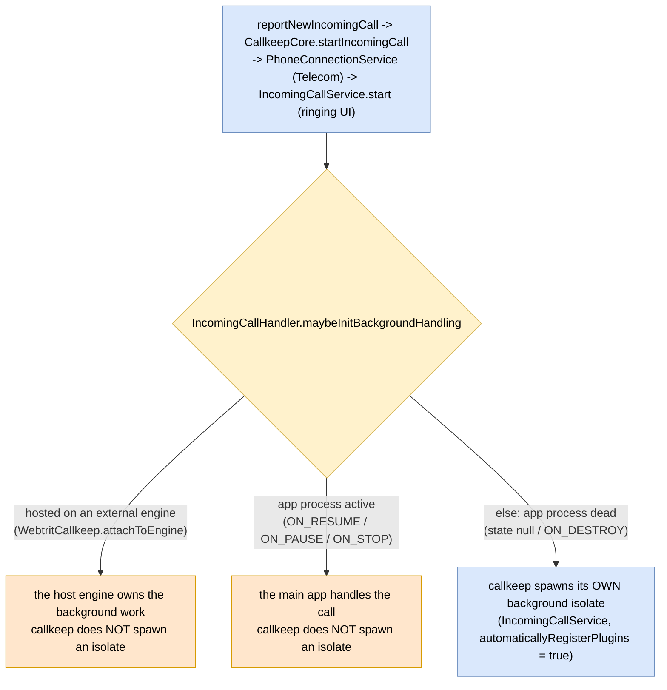
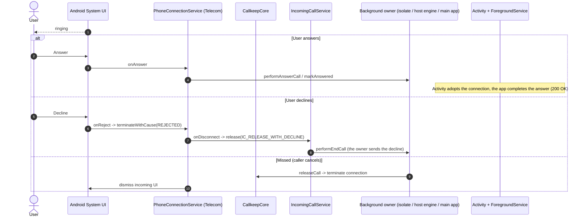

# Incoming call handling (decision + outcomes)

How callkeep decides who runs the background work for an incoming call, and the terminal outcomes
it drives. callkeep is transport-agnostic: it does not know whether a call arrives via push, a
persistent socket, or in-app signaling. The integrator reports the call; callkeep presents it via
Android Telecom and routes call control.

Related: step-by-step flows in [call-flows.md](call-flows.md); services in
[background-services.md](background-services.md) and [foreground-service.md](foreground-service.md);
hosting callkeep on an app-owned engine in
[../../docs/external-flutter-engines.md](../../docs/external-flutter-engines.md).

Color: blue = callkeep, orange = host app, grey = external (Telecom / system UI), yellow = decision.

## Who owns the background work

After a call is reported and `IncomingCallService` starts,
`IncomingCallHandler.maybeInitBackgroundHandling`
decides whether callkeep spawns its own background isolate:

## Terminal outcomes

The owner that reported the call drives the outcome; callkeep mediates through Telecom and
`IncomingCallService`. The owner is the callkeep isolate, the host engine, or the main app
(see the decision above).

## Delivery to the Flutter delegate

Surfacing the incoming call in a Flutter delegate (`didPushIncomingCall`) happens through different
channels depending on where the call materialises and which engine is attached. There are two
`ConnectionEventListener`s: `ForegroundService` (main process, **bound to the Activity** — the
foreground delegate) and `IncomingCallService` (background isolate); see
[foreground-service.md](foreground-service.md) and [background-services.md](background-services.md).

| Context                                                               | How the delegate learns of the incoming call                                                                                                      | Live `IncomingConnectionReported` -> `didPushIncomingCall`                                                                                       |
|-----------------------------------------------------------------------|---------------------------------------------------------------------------------------------------------------------------------------------------|--------------------------------------------------------------------------------------------------------------------------------------------------|
| Foreground signaling (`reportNewIncomingCall`)                        | The app's own signaling creates the call in Dart (`__onCallSignalingEventIncoming`)                                                               | **suppressed** — `reportNewIncomingCall` set the `reportedIncoming` guard, so the broadcast is not re-delivered (would duplicate the ActiveCall) |
| Push -> foreground handoff (call exists before the Activity comes up) | `onDelegateSet` -> `replayConnectionStates` -> `ReplayIncomingCall` -> `didPushIncomingCall` re-delivers on attach                                | not the delivery — it fired before `ForegroundService` was alive                                                                                 |
| Background, app dead                                                  | `IncomingCallService` shows the call directly via `IncomingCallHandler` on its own isolate delegate; its event listener only acts on `AnswerCall` | not used by `IncomingCallService`                                                                                                                |
| SMS trigger (`IncomingCallSmsTriggerReceiver` -> `startIncomingCall`) | No signaling and the delegate is already attached (Activity up), so the live `didPushIncomingCall` is the only delivery                           | the delivery — but the SMS path is dormant (see below)                                                                                           |

**Invariant.** `ForegroundService` is the foreground `ConnectionEventListener` and is bound to the
Activity lifecycle (`bindForegroundService` on attach, `unbind + stop` on detach). Its live
`IncomingConnectionReported` -> `didPushIncomingCall` delivery is therefore **foreground-only**.
With the SMS trigger not in use, every real foreground incoming reaches the delegate via either its
own signaling (live delivery suppressed) or the `onDelegateSet` replay (handoff) — so the live
delivery has **no remaining live consumer**; it is kept only as the contract for the dormant SMS
path. Background incoming is delivered by `IncomingCallService` directly, not by this event. The
`IncomingConnectionReported` event itself is still load-bearing for its **registration** side
(promote into the shadow tracker + resolve the pending `reportNewIncomingCall` Pigeon callback),
which is independent of the delegate delivery.

## SMS-triggered incoming (dormant / likely deprecated)

The SMS-based incoming-call trigger (`IncomingCallSmsTriggerReceiver` +
`SmsReceptionConfigBootstrapApi.initializeSmsReception`, message prefix `<#> WEBTRIT:`) is
**currently not tested and not actively developed — treat it as dormant / likely deprecated**. It
is the only path that relies on the live `IncomingConnectionReported` -> `didPushIncomingCall`
delivery while the app is foreground. Do not assume it is exercised; verify before depending on it.
